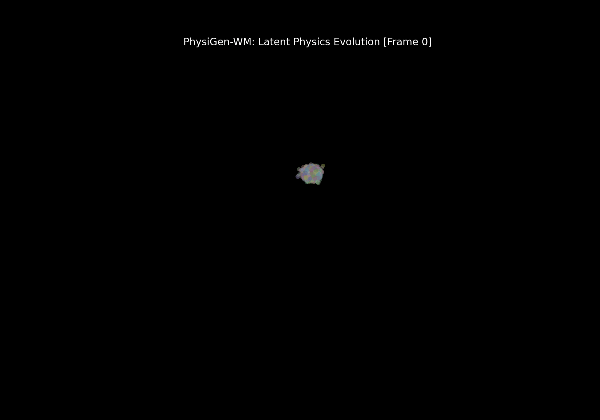
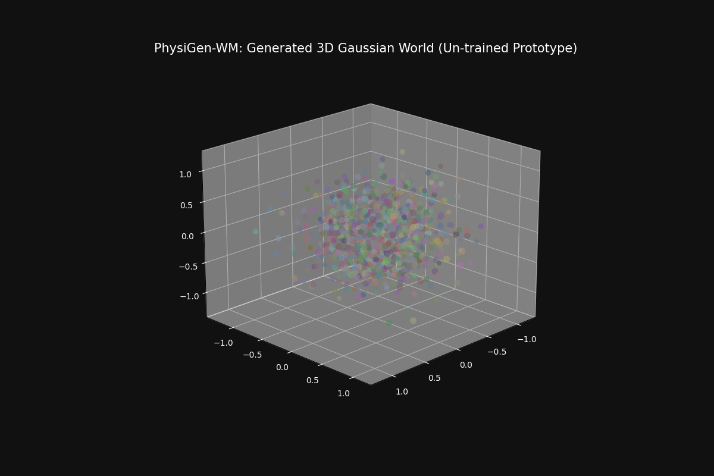

# PhysiGen-WM: Physically Consistent World Models

PhysiGen-WM is a research framework for integrating Lagrangian dynamics and 3D Gaussian Splatting into generative world models.

## 🚀 Key Research Innovations

### 1. Continuous Lagrangian Manifolds (Neural ODE)
Unlike discrete Seq2Seq models, PhysiGen-WM models the infinitesimal phase-space flow using a **4th-order Runge-Kutta (RK4)** solver. This ensures that the generated 3D world maintains physical continuity even at arbitrary temporal resolutions.

### 2. Variance-Constrained Optimization (VCO)
To stabilize the training of Physics-Informed Neural Networks (PINNs), we introduce a **VCO Loss** term:

$$ L_{VCO} = \text{Var}(\hat{z}_{t+1} - \hat{z}_{t}) $$

By minimizing the variance of the residuals, we suppress high-frequency numerical oscillations and enforce smoother gradient flow during the discovery of Hamiltonian gradients.

### 3. Spatial-Relational Attention (4-head)
We employ a multi-head attention mechanism with **Conflict-Resolved Gating** to model the geometric dependencies between Gaussian primitives. This prevents structural "collapse" or "fragmentation" during high-velocity transitions.

### 4. Anisotropic Collision Awareness (ACA)
Standard latent physics models treat primitives as point masses. We upgraded the **CollisionRegularizer** to account for **anisotropic scaling** ($s_i$). The interaction potential now scales with the effective geometric radius $R_{ij} = r_{base} + s_i + s_j$, preventing visual artifacts in compressed or elongated Gaussian clusters.

## 📺 Demo: Latent Physics Evolution

*A preview of 3D Gaussian collectives evolving via the internal Lagrangian ODE solver (Untrained Prototype).*

## 🔮 Generative Capabilities (Text-to-3D World)

*Initial output of the Gaussian Generative Head driven by latent physics.*

## 🛠 Project Structure
- `src/models/`: Lagrangian ODE Solvers, Gaussian Heads, and Text Adapters.
- `src/trainer.py`: Multi-GPU ready training logic with VCO and Hamiltonian loss.
- `src/utils/visualizer.py`: Utility for exporting Gaussian parameters to `.ply` format.
- `configs/`: YAML-based hyperparameter management.

## Getting Started
1. Clone to high-performance server (A100/H100 recommended).
2. Install dependencies: `pip install torch torchvision yaml tqdm`
3. Run training: `python src/trainer.py --config configs/default.yaml`

### 5. Spectral Repulsion & Lorentzian Potential
Upgraded the **CollisionRegularizer** to incorporate a **Spectral Repulsion** term. This replaces the naive squared ReLU with a Lorentzian-dampened potential $V = \frac{\delta^2}{1 + \epsilon \delta}$, where $\delta$ is the geometric overlap. This ensures numerical stability during high-density primitive interactions and prevents gradient explosion in the latent Lagrangian field.

### 6. Orientation-Aware Projection (OAP) Interaction
Upgraded the interaction model in `CollisionRegularizer` to support **OAP Interaction**. Unlike isotropic approximations, OAP explicitly calculates the projection of each Gaussian's covariance ellipsoid along the interaction vector using the rotation manifold ($R \in SO(3)$). The directional radius is derived as $r_i(\mathbf{u}) = \|\mathbf{S}_i \mathbf{R}_i^T \mathbf{u}\|_2$, enabling high-fidelity collision constraints for extremely elongated or flattened Gaussian primitives.

---
*Last Academic Update: 2026-02-10 12:45 (Singapore)*

### 7. Phase-Space Entropy Regularization (PSER)
Implemented **PSER** in the `LagrangianODESolver` to mitigate the "fixed-point collapse" common in high-dimensional latent physics. By penalizing the log-inverse pair-wise distance in the latent phase-space ($\mathcal{L}_{PSER} = -\mathbb{E}[\log(\|z_i - z_j\| + \epsilon)]$), we enforce a more expressive manifold distribution, ensuring that the generated 3D Gaussian trajectories remain diverse and topologically complex over long temporal horizons.

### 8. Causal-Spectral Hamiltonian Weighting
Refined the Hamiltonian conservation loss to include **Causal Weighting**. The penalty for energy drift ($dH/dt$) is now exponentially decayed over time, prioritizing the stabilization of the "initial flow" during training. This prevents numerical errors in early-time steps from propagating and destabilizing the entire 4th-order Runge-Kutta trajectory.

